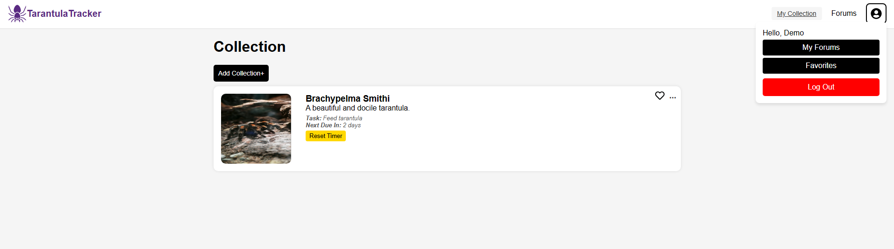
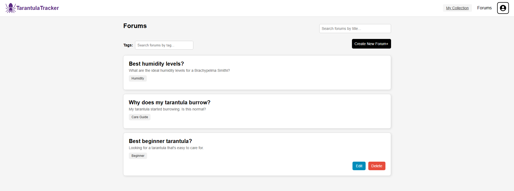

#  Tarantula Tracker

Tarantula Tracker is a web application for hobbyists and breeders to manage their collection of tarantulas. This tool helps you keep track of species, feeding/molt schedules, forum discussions, favorites, and care reminders all in one place.

##  Live Site

-> [View the deployed site here](https://tarantulatracker.onrender.com)

---

##  Features

-  Add, edit, and delete tarantulas in your collection
-  Task reminder system with resettable interval timers
-  Forum discussions and threaded replies
-  Favorite your most prized tarantulas
-  Image uploads for each tarantula
-  Authentication and protected routes

---

##  Local Setup Instructions

Follow the steps below to clone and run this project locally.

### 1. Clone the repository

```bash
git clone https://github.com/Mortemus763/TarantulaTracker.git
cd tarantula-tracker
```

### 2. Backend Setup (Flask + PostgreSQL)

> Ensure Python 3 and PostgreSQL are installed on your system.

```bash
pipenv install -r requirements.txt
pipenv shell
```

Create a `.env` file based on the provided `.env.example`:

```env
SECRET_KEY=your_secret_key
FLASK_APP=app
FLASK_ENV=development
DATABASE_URL=your_postgres_url
SCHEMA=tarantula_tracker
```

Run the migrations and seed data:

```bash
flask db upgrade
flask seed all
flask run
```

### 3. Frontend Setup (React + Vite)

```bash
cd react-vite
npm install
npm run dev
```

The frontend should now be running at `http://localhost:5173`

---

##  Tech Stack

**Frontend**  
- React.js (Vite)  
- Redux Toolkit  
- CSS Modules

**Backend**  
- Flask  
- SQLAlchemy  
- PostgreSQL  
- Flask-Migrate  
- Flask-Login

---

## ScreenShots



